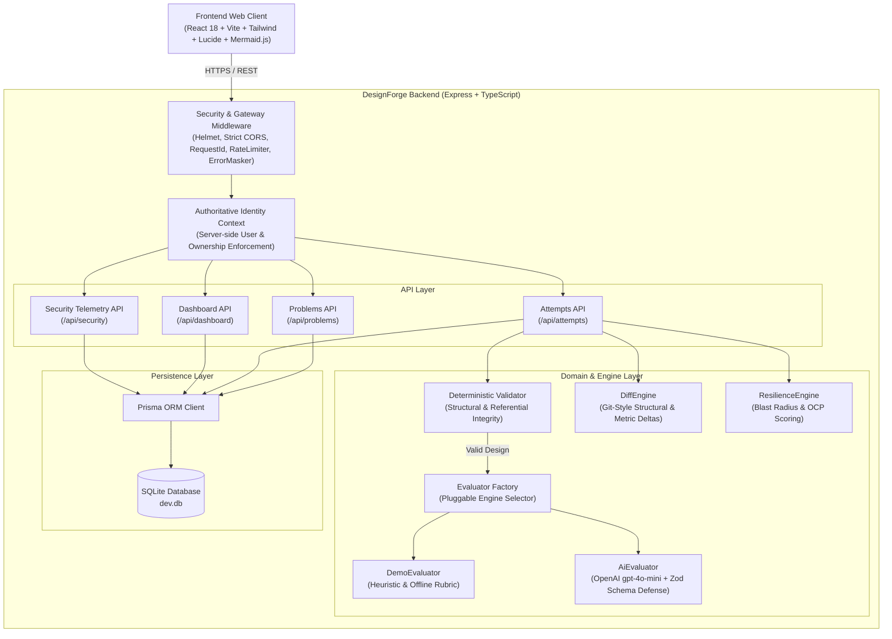
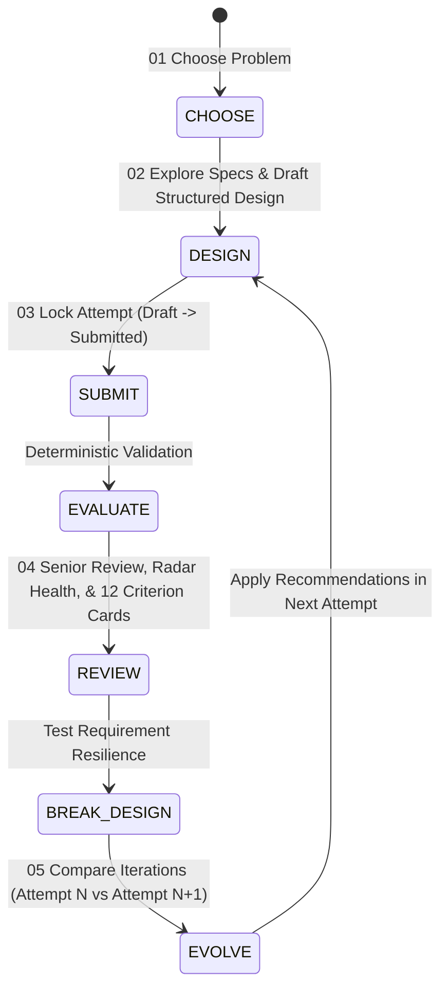
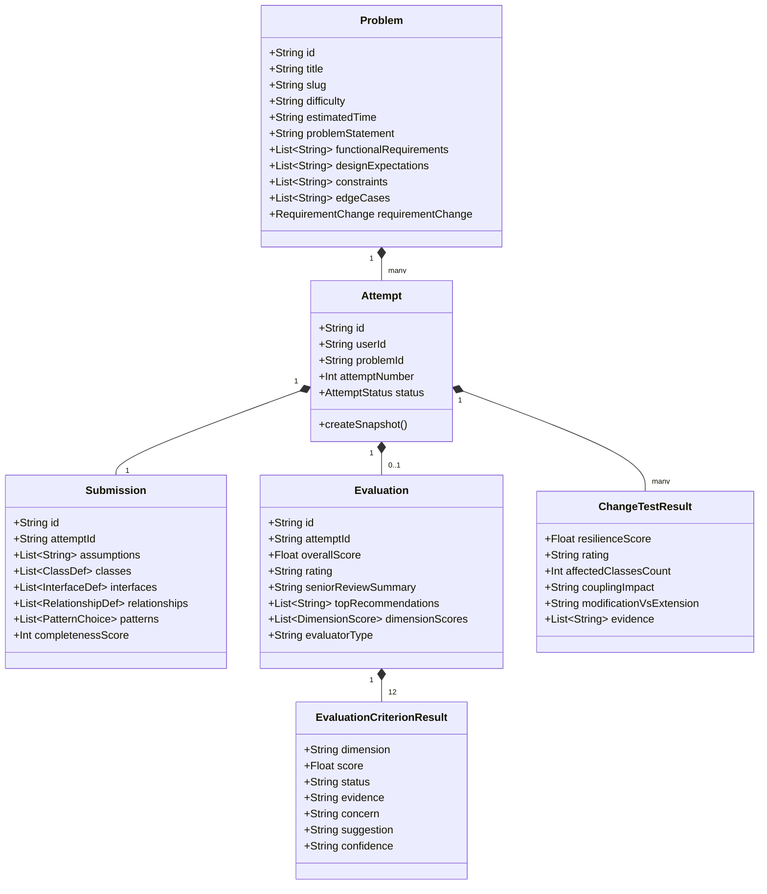
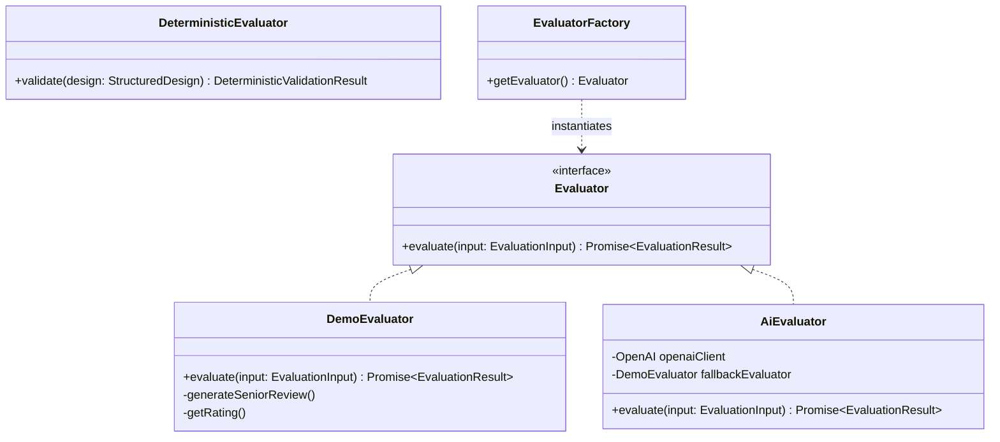
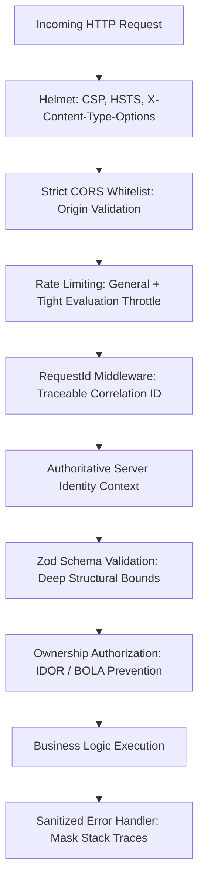

# DESIGN DOCUMENT: DesignForge Architecture & Domain Specification

**System:** DesignForge — AI-Powered LLD Practice Studio  
**Tagline:** *Design. Defend. Improve.*  
**Author:** Staff Software Architect  
**Architecture:** Modular Monolith (Express, TypeScript, React, Vite, SQLite, Prisma)  
**Date:** March 2025  

---

## 1. Product Goal & Problem Statement

Low-Level Object-Oriented Design (LLD) is essential for producing robust, extensible software systems. However, learners frequently struggle to evaluate their own architectures:
- They lack visibility into whether responsibilities adhere to the Single Responsibility Principle (SRP).
- They have no automated mechanism to test if their class coupling is dangerously high.
- They cannot measure whether subsequent iterations actually improved architectural health.
- They cannot test if their design survives volatile requirement changes without manual human review.

**DesignForge** solves this through an explainable practice workstation featuring **Structured Design Modeling**, **Deterministic Structural Validation**, **Pluggable AI/Heuristic Evaluation across 12 dimensions**, **Git-style Design Evolution Diffs**, and **"Break My Design" Requirement Resilience Testing**.

---

## 2. System Architecture Overview

DesignForge is intentionally designed as a **Modular Monolith**. It balances sub-millisecond local execution, minimal operational overhead, and strong domain boundary enforcement without distributed systems complexity.



---

## 3. Core Learner Loop & User Journey

The application enforces a clear pedagogical loop:



---

## 4. Domain Model & Class Responsibilities



### Domain Abstraction Principles
- **Separation of Presentation from Domain:** The `StructuredDesign` entity models classes, attributes, methods, and relationships structurally. It does not depend on Mermaid or React. Mermaid syntax generation is handled by a polymorphic `UmlGenerator` service.
- **Immutable Historical Attempts:** Attempts are never overwritten. Every iteration is stored as a distinct, immutable `Attempt` entity (`Attempt #1`, `Attempt #2`, `Attempt #3`). This enables deterministic historical comparison.

---

## 5. Evaluation Engine Architecture

### Pluggable Evaluator Contract
To ensure that DesignForge can be evaluated without any external API keys or network dependencies, evaluation is abstracted behind the `Evaluator` interface:

```typescript
export interface Evaluator {
  evaluate(input: EvaluationInput): Promise<EvaluationResult>;
}
```



### The 12 Architectural Dimensions
1. **Requirement Understanding:** Functional boundary coverage and capacity assumptions.
2. **Responsibility Assignment:** Adherence to Single Responsibility Principle (SRP); avoidance of God Objects.
3. **Coupling:** Density of direct inter-entity dependencies; application of Law of Demeter.
4. **Cohesion:** Degree to which methods operate on shared domain attributes.
5. **Encapsulation:** Visibility boundaries (private/protected) and state mutation mutators.
6. **Interfaces:** Presence of polymorphic contracts decoupling callers from concrete implementations.
7. **Abstraction:** Substitution of procedural switch/case branching with polymorphism.
8. **Pattern Fit:** Judicious application of GoF patterns (Strategy, State, Observer, Factory) vs. over-engineering.
9. **Extensibility:** Open/Closed Principle (OCP) adherence when accommodating future extensions.
10. **Edge Cases:** Defense against capacity limits, lost tickets, concurrency races, and error states.
11. **Testability:** Constructor dependency injection and mockable interface contracts.
12. **Explanation Quality:** Articulation of technical trade-offs and engineering rationale.

---

## 6. Security Architecture & Threat Model

DesignForge implements **Defense-in-Depth** across all system boundaries:



### Threat Modeling & Countermeasures
| Threat Category | Potential Attack Vector | DesignForge Countermeasure |
| :--- | :--- | :--- |
| **BOLA / IDOR** | Attacker queries or updates another user's attempt ID directly. | Authoritative server-side ownership check on all `/api/attempts/:id` routes. Returns `403 FORBIDDEN`. |
| **AI Prompt Injection** | User embeds malicious system override instructions into class names or responsibilities. | All submission text is treated strictly as passive JSON data; system prompt mandates rigid output formatting; Zod validates response strictly. |
| **Denial of Service** | Rapid repeated triggering of expensive AI or resilience evaluations. | `express-rate-limit` enforces a specialized throttle (max 15 evaluations per minute per IP). |
| **XSS & Injection** | User submits script tags or HTML entities in design descriptions. | React escape encoding by default; strict regex validation on entity identifiers (`/^[A-Za-z_][A-Za-z0-9_]*$/`). |
| **Information Disclosure** | Database errors or internal exceptions leak stack traces or SQL schemas. | Centralized sanitized error handler logs safely on server and returns only `{ error: { code, message, requestId } }`. |
| **Secret Leakage** | API keys or database connection strings committed to Git or exposed via frontend bundles. | Secrets kept in `.env` (gitignored); zero `VITE_` secret exposure; `DEMO_MODE=true` default. |

---

## 7. Engineering Trade-offs & Judgement

1. **Why SQLite over PostgreSQL?**  
   *Decision:* SQLite via Prisma.  
   *Rationale:* This is a focused 2-day engineering assignment prototype. SQLite provides zero-installation setup for the hiring evaluator, instant schema migrations, and sub-millisecond local latency while preserving full relational integrity.
2. **Why Modular Monolith over Microservices?**  
   *Decision:* Single Node.js/Express service with distinct domain, route, and engine layers.  
   *Rationale:* Low-Level Design is about object-oriented boundaries within a process. Distributing this across multiple services would introduce network flakiness, latency, and unnecessary DevOps complexity without pedagogical benefit.
3. **Why Structured Submission over Free-form Text?**  
   *Decision:* Explicit classes, interfaces, attributes, and relationships.  
   *Rationale:* Structured data enables deterministic validation, dynamic UML diagram synthesis, algorithmic Git-style diffing, and grounded AI evaluation with 0% hallucinated entities.
4. **Why DemoEvaluator as First-Class?**  
   *Decision:* Build high-fidelity deterministic heuristics that work completely offline.  
   *Rationale:* Hiring evaluators must be able to test the application immediately without providing a paid OpenAI API key.
